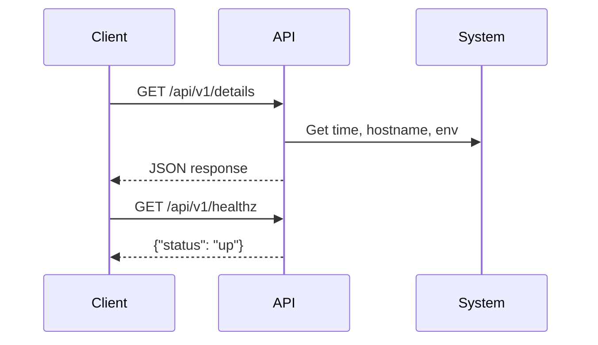

# Architecture

This application is a lightweight REST API built with Flask.

## Endpoints

- `/api/v1/details`: Returns a JSON object with a greeting, current server time, hostname, and an environment variable.
- `/api/v1/healthz`: Returns a simple health check status.

## Service endpoint

```bash
kubectlk get svc python-api-app-python-app -n pythonapp -o jsonpath={.status.loadBalancer.ingress[0].hostname}
```

http://k8s-pythonap-pythonap-7e1a7b33c4-bc457fbefdcc986a.elb.us-east-2.amazonaws.com:5000/api/v1/details

## Images

[Dockerhub/johnyunez](https://hub.docker.com/repository/docker/johnyunez/python-api-app)

## Components

- **Flask**: Web framework for Python.
- **Docker** (optional): For containerized deployment.
- **Environment Variables**: Reads `INFRA_DATA` for configuration.

## Sequence Diagram

